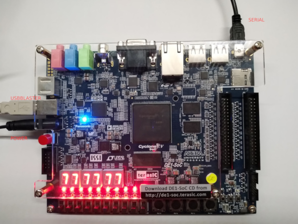
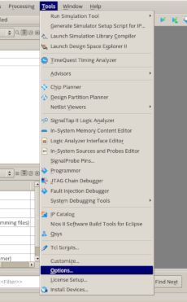
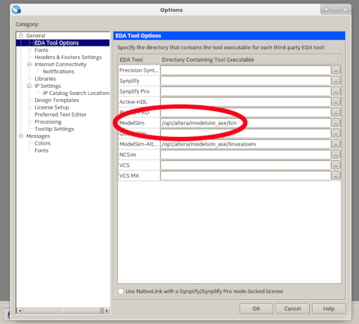
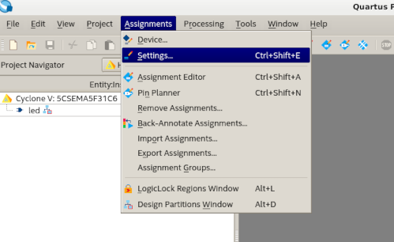
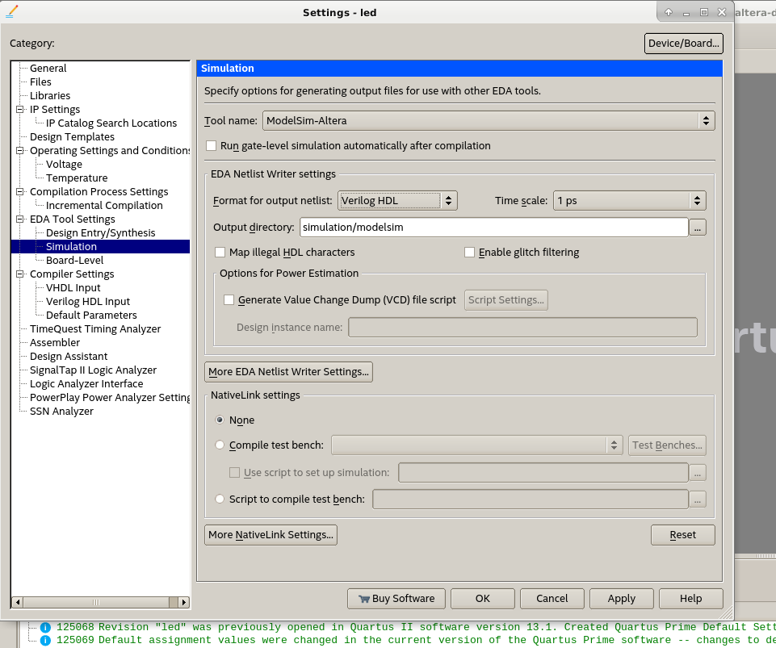
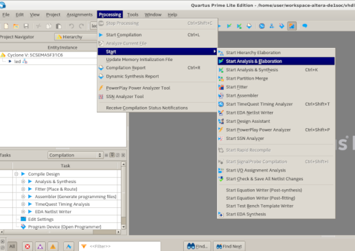
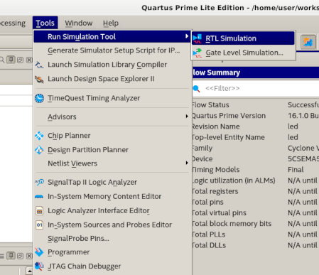

# Container for my Cyclone V IDE: Altera Quartus

Contains a Dockerfile for creating a docker image of the **Quartus 16.1** build environment for my **DE1-SoC Board (rev D)** from Terrasic (University Program).

Building the image will install Quartus. Using a container from the image will start Quartus. Then ModelSim will be downloaded. ModelSim will be installed to _/opt/altera_ as well.

The **workspace** folder will be mounted as /home/user inside the docker. It will serve as workspace and may kept under git outside the docker container.


## Resources

Terrasic Material  
https://www.terasic.com.tw/cgi-bin/page/archive.pl?Language=English&No=836
https://www.terasic.com.tw/cgi-bin/page/archive.pl?Language=English&No=836&PartNo=4

Getting started with the DE1-SoC video serie  
https://www.youtube.com/playlist?list=PLKcjQ_UFkrd7UcOVMm39A6VdMbWWq-e_c

Cornell University Material on the DE1-SoC Board (links)  
https://people.ece.cornell.edu/land/courses/ece5760/DE1_SOC/index.html

Download links for Quartus Editions (direct links, no Intel registration)  
https://github.com/CTSRD-CHERI/quartus-install/blob/master/quartus-install.py

Installation notes by Giuseppe Scollo, University of Catania, DMI  
http://www.dmi.unict.it/~scollo/slidy/sd-2018/sd_e01/tips/QuartusInstall.txt

JTAG  
(remember product id can be 6810 or 6010, see comments)  
https://gladdy.github.io/2017/03/18/Altera-udev.html


## Setup



**On the host system**, make sure the device of the board i.e. ``/dev/bus/usb/<MAJOR>/<MINOR>`` is accessible.

```
$ lsusb | grep -i altera
    Bus 001 Device 050: ID 09fb:6810 Altera
```
From the above take the path ``/dev/bus/usb/001/050``
* Bus number: 001 -> running the container will need ``--privileged -v /dev/bus/usb/001:/dev/bus/usb/001``
* Device number: 050

Now check the access rights on host (permissions should be **666**).

```
$ sudo ls -l /dev/bus/usb/001/050
    crw-rw-r-- 1 root root    189, 129 Nov 13 16:11 050
```

In the above case (permissions: 664), setup an udev rule: ``/etc/udev/rules.d/92-blaster.rules`` with the following content:
```
# Intel FPGA Download Cable
SUBSYSTEM=="usb", ATTRS{idVendor}=="09fb", ATTRS{idProduct}=="6001", MODE="0666"
SUBSYSTEM=="usb", ATTRS{idVendor}=="09fb", ATTRS{idProduct}=="6002", MODE="0666"
SUBSYSTEM=="usb", ATTRS{idVendor}=="09fb", ATTRS{idProduct}=="6003", MODE="0666"

# Intel FPGA Download Cable II
SUBSYSTEM=="usb", ATTRS{idVendor}=="09fb", ATTRS{idProduct}=="6010", MODE="0666"
SUBSYSTEM=="usb", ATTRS{idVendor}=="09fb", ATTRS{idProduct}=="6810", MODE="0666"
```

Still on host reload udev and check.
```
$ sudo udevadm control --reload-rules && sudo udevadm trigger

$ sudo ls -l /dev/bus/usb/001/
    crw-rw-rw- 1 root root    189, 129 Nov 13 16:11 050
```


## Build

Installation uses last release freely available on the net (in 2019). The folder _docker_ stands for the corresponding docker__* version.

```
$ cd docker
$ time docker build --build-arg USER=$USER -t rubuschl/cyclone-v-ide:$(date +%Y%m%d%H%M%S) .
```


## Usage

Find the correct tag as follows. Here we take _20191104161353_ as an example tag. Make sure to use the correct bus, here **001**, identified above!

```
$ docker images
    REPOSITORY               TAG                 IMAGE ID            CREATED             SIZE
    rubuschl/cyclone-v-ide   20191104161353      cbf4cb380168        24 minutes ago      15.5GB
    ubuntu                   xenial              5f2bf26e3524        4 days ago          123MB

$ xhost +"local:docker@"

$ docker run --rm -ti --privileged -v /dev/bus/usb/001:/dev/bus/usb/001 -e DISPLAY=$DISPLAY -v /tmp/.X11-unix:/tmp/.X11-unix -v /sys:/sys:ro -v $PWD/workspace:/home/user --user=$USER:$USER --workdir=/home/$USER rubuschl/cyclone-v-ide:20191104161353
```
NB: the docker container does not serve for a safer environment, it is meant as a solution for archiving the quartus setup, as safe or dangerous as a native installation would be, e.g when bind mounting /dev.


## (opt) ModelSim

ModelSim first has to be configured in Quartus.


### Configure ModelSim in Quartus

TODO: check setup for student / free license to use ModelSim

In quartus provide a valid path to the ``_ase`` version's bin under **ModelSim Altera**: ``_/opt/altera/modelsim_ase/bin/_``. Configure the EDA Tool Options.




Configure the Simulator settings.





### Add Signals in ModelSim

Setup in Modelsim.



In ModelSim, go to the **Library** window, open the **work** tree and rightclick the top level file of the project, and select **Create Wave**.

Delete signals: In the wave window by marking, and then hitting the del key.

Create signals: In the wave window rightclick the signal, e.g. clk, and select **Edit** -> **Create/Modify Waveform**: the create pattern wizzard appears!



Under patterns, select **Clock**

 * **Start Time**   : 0
 * **End Time**     : 5000
 * **Time Unit**    : ns

Click "Next"

 * "Clock Period** : 100
 * "Time Unit**    : ns
 * "Duty Cycle**   : 50

Click **Finish**


## (opt) Arbiter Testbench

TODO installation of Arbiter Testbench


## Debug

For debugging the container login to the docker container

```
$ docker images
    REPOSITORY               TAG                 IMAGE ID            CREATED             SIZE
    rubuschl/cyclone-v-ide   20191104161353      cbf4cb380168        24 minutes ago      15.5GB
    ubuntu                   xenial              5f2bf26e3524        4 days ago          123MB

$ xhost +"local:docker@"

$ docker run --rm -ti --privileged -v /dev/bus/usb/001:/dev/bus/usb/001 -e DISPLAY=$DISPLAY -v /tmp/.X11-unix:/tmp/.X11-unix -v /sys:/sys:ro -v $PWD/workspace:/home/$USER --user=$USER:$USER --workdir=/home/$USER rubuschl/cyclone-v-ide:20191104161353 /bin/bash
```

In the container start quartus as follows
```
docker$ source ~/env.sh
docker$ quartus
```


## Issues

* Working with the target for the DE1-SoC usually means to flash an SD card. The .sof files can be converted into .rbf files which then can also be loaded dynamically at runtime under the installed  Linux board support package (BSP) to the FPGA fabric. Further, for the DE1-SoC you may use a tftp boot and nfs setup as automation solution. As a hint, the Cyclone V SoC had quite some community support by EBV's Socrates Board users, thus the configuration for the altera/Socrates board also should run well for the terrasic/DE1-SoC board.

* For hardware access, e.g. using Qsys, run the docker container with ```--privileged``` mode

* Quartus may fall into a state to only shows empty, blank windows. Set ```export QT_X11_NO_MITSHM=1```, or source _```~/env.sh```.

* Quartus installation process is known to hang in the end. The fix I found is to install it with the ui _minimal_. In cases where this does not help, the install process may be stopped after some minits of inactivity, then restarted (in case needs to be implemented then in the docker file). Where a second execution of the build Quartus usually should run smoothly.

* Quartus 16.1 nowadays (2019) is a bit old. It is still relatively small, though, having around 15GB compared to Quartus 19.x with around 55GB. Alternatively install a more recent version: Download a version of _Quartus_ **manually** from Intel and best might be to import it via webserver i.e. localhost and e.g. configured apache. Easiest then is to use your already configured webserver's _DirectoryRoot_ i.e. _/var/www/html_ on debian (test with localhost). There create another directory named _"quartus"_. Move the Quartus tarball into this directory. Pass the exact name of that tarball as build argument to the docker build instruction. And adjust the Dockerfile: instead of downloading from internet, now use the tarball (this is rather an idea, since more recent Quartus also implies a more recent base system, means different set of libs to be installed, etc, etc. - I haven't really tested this). Remember to use ```--network host``` for accessing the localhost!

```
$ sudo mkdir /var/www/html/quartus
$ sudo mv <the downloaded quartus> /var/www/html/quartus/

$ cd docker
$ time docker build --build-arg QUARTUS="Quartus-pro-16.1.0.196-linux-complete" -t rubuschl/cyclone-v-ide:$(date +%Y%m%d%H%M%S) .
```

* The "No space left" issue at building the image, can be a docker issue, in case set the minimum image size up to e.g. 50GB:
```
$ sudo systemctl stop containerd
$ sudo systemctl stop docker
$ sudo vi /etc/docker/daemon.json
    {
      "storage-driver": "devicemapper",
      "storage-opts": [
            "dm.basesize=50G"
      ]
    }
$ sudo systemctl start containerd
$ sudo systemctl start docker
```

* The "permission denied" may happen if you forget either to set the _-w_ directive, or the _-u_ directive, or both at the _docker run_ command, it then falls back to root and/or /root - best is to simply copy&paste the commands here.

* JTAG connection, or JTAG/USB Blaster Massacre.. Note the following:
  * Host machine needs udev rule ``/etc/udev/rules.d/92-usbblaster.rules`` to give **666** permissions to the device handle for the usbblaster device.
  * Container needs to be run with ``--privileged``, in order to allow something like ``ls -l /dev/bus/usb/001`` with user privileges
  * Container needs to be run with ``-v /dev/bus/usb/001:/dev/bus/usb/001``, to re-mount dynamically by host's udev e.g. turn off device, and turn it on again wich will change the device number. BTW the bus (currently) is pretty stable and will stay the same.

* If QSYS shows the error ``... Can't locate Getopt/Long.pm in @INC ...``, the following fix is documented:
```
$ sudo apt install libgetopt-simple-perl
$ cd altera/19.1/quartus/linux64/perl/bin
$ mv perl perl_old
$ ln -s /usr/bin/perl
```

* Software updates for 16.1: So, see first the Download and install instructions under the Combined Files tab in the aforementioned page and press the fat arrow on the right of Quartus-lite-16.1.0.196-linux.tar (not the _Updates Available_ link, which is close to the fat arrow but leads to the Updates tab). When the installation of the base software is done, then you may switch to the Updates tab and thereby perform the second phase, see Download and install instructions under this tab. You only need to download and install the Quartus Prime Software v16.1 Update 2, since it includes all previous updates.

* A separate download and installation which should follow the previous ones is that of the Intel FPGA University Program software, which includes the Monitor Program, a few IP cores, and more. Download the University Program Installer tarball, intel_fpga_upds_setup.tar, from:  
https://www.altera.com/support/training/university/materials-software.html#ifup_software_upds


*  ModelSim: "Can't launch ModelSim-Altera Simulation software -  make sure the software is properly installed and the environment variable LM_LICENSE_FILE or GGLS_LICENSE_FILE points to the correct license file."
  **FIX**: run in the shell
```
$ /opt/altera/13.1/modelsim_ase/linuxaloem/vsimk
```
Illegal instruction (TODO: what was this again??)
```
$ /opt/altera/13.1/modelsim_ase/linuxaloem/vish
```

* ModelSim: error while loading shared libraries
```
/opt/altera/13.1/modelsim_ase/linuxaloem/vish: error while loading shared
libraries: libXft.so.2: cannot open shared object file: No such file or
directory
```
**FIX**: install missing libraries as i386 version (btw. make sure that apt is able to handle :i386 packages, when installing into an 64bit system!)
```
$ sudo aptitude install libxft2:i386
$ sudo aptitude install libncurses5:i386
```

TODO there was something with the iar.. libs package (x86 compatibility libraries)

